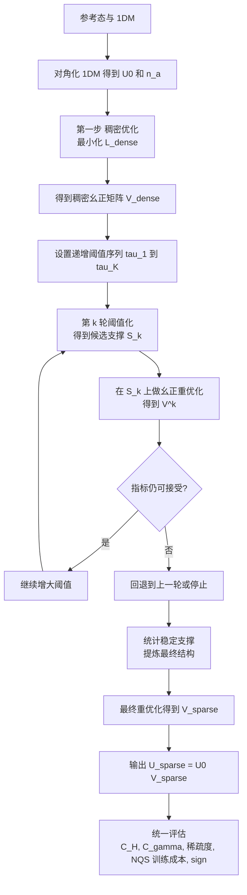

# optimization_flow

## 1. 一页总览

这份文档想解决的问题很简单：

从参考 1DM 的自然轨道基出发，先找到一个在物理上还合理、但能降低哈密顿量复杂度的稠密幺正变换；然后不要一次性硬截断，而是逐步提高阈值、连续剪枝、连续重优化；最后把在多轮剪枝中稳定保留下来的部分固化成稀疏结构，得到一个稀疏幺正基底。

如果只记住一句话，那么就是：

> 先找一个好的稠密方向，再连续剪枝找出稳定结构，最后把稳定结构做成真正可用的稀疏幺正基底。

### 1.1 总体三步

1. 稠密优化：
   从自然轨道参考系出发，优化一个稠密幺正矩阵，使哈密顿量复杂度下降，同时尽量不破坏 1DM 占据结构。

2. 连续阈值化与结构发现：
   不一次性截断，而是逐步增大阈值；每升高一次阈值，就立刻做一次幺正重优化，并记录哪些位置稳定保留下来。

3. 最终结构化重优化：
   把稳定保留下来的支撑变成最终结构，再做最后一轮稀疏幺正优化，输出最终基底。

### 1.2 输入与输出

输入：

- 单体矩阵 $t\in\mathbb C^{M\times M}$；
- 参考 1DM，记为 $\gamma\in\mathbb C^{M\times M}$；
- 复杂度权重 $\omega_{ab}$；
- 描述相互作用空间结构的矩阵 $S_{ij}$；
- 阈值序列 $\tau_1<\tau_2<\cdots<\tau_K$；
- 超参数 $\lambda_\gamma,\lambda_{\rm loc},\lambda_{\rm fit}$；
- 接受准则 $\eta_H,\eta_\gamma$。

输出：

- 稠密最优矩阵 $V_{\rm dense}$；
- 多轮阈值下的稳定支撑；
- 最终稀疏幺正矩阵 $V_{\rm sparse}$；
- 最终基底 $U_{\rm sparse}=U_0V_{\rm sparse}$。

### 1.3 小参数表

下面给一套适合第一版程序的默认值。它们不是唯一正确值，但足够作为起步配置。

| 参数 | 作用 | 建议初值 | 调参直觉 |
| --- | --- | --- | --- |
| $\varepsilon$ | 平滑项，避免分母或根号奇异 | $10^{-8}$ | 太大则目标变钝，太小则数值不稳 |
| $\lambda_\gamma$ | 1DM 软约束强度 | $0.05\sim 0.1$ | 太小则占据结构容易跑飞，太大则复杂度降不下来 |
| $\lambda_{\rm loc}$ | 局域性正则强度 | $0$ 起步 | 先关掉，只有轨道明显扩展时再开到 $10^{-2}\sim 5\times 10^{-2}$ |
| $\lambda_{\rm fit}$ | 相邻阈值轮之间的贴近强度 | $0.1\sim 1$ | 太小则每轮跳动过大，太大则不容易继续稀疏化 |
| $\delta_{\rm occ}$ | full / active / empty 分层阈值 | $10^{-2}$ 或 $5\times 10^{-2}$ | 系统越噪，阈值可适当放大 |
| $\delta_{\rm gap}$ | 按 occupation gap 划 block 的阈值 | $5\times 10^{-2}$ | 想切出更少 block 就增大 |
| $m$ | 每行每列至少保留的 top-$m$ 元素数 | $1$ | 第一版直接取 $1$ 最稳 |
| $f_{\rm min}$ | 稳定支撑的持久度阈值 | $0.6\sim 0.8$ | 越大越保守，留下的结构越稳定 |
| $\eta_H$ | 复杂度恶化容忍度 | $0.02\sim 0.05$ | 越小越严格 |
| $\eta_\gamma$ | 1DM 偏离恶化容忍度 | $0.05\sim 0.1$ | 越小越严格 |
| $\mathrm{tol}_{\rm unitary}$ | 幺正误差容忍度 | $10^{-6}$ | 若优化器较粗糙可临时放到 $10^{-5}$ |
| $\mathrm{tol}_{\rm mask}$ | 掩码误差容忍度 | $10^{-8}$ | 应比幺正误差更严格 |
| $T_{\rm dense}$ | 稠密优化轮数 | $200\sim 1000$ | 看收敛曲线决定 |
| $T_{\rm inner}$ | 每轮阈值后的内循环步数 | $50\sim 200$ | 掩码越激进，通常需要更多步 |
| $\eta$ | 内循环梯度步长 | $10^{-3}\sim 10^{-2}$ | 不稳定就减小，太慢就增大 |

如果只想要最小可运行配置，可以先固定：

- $\lambda_\gamma=0.05$
- $\lambda_{\rm loc}=0$
- $\lambda_{\rm fit}=0.3$
- $\delta_{\rm occ}=10^{-2}$
- $m=1$
- $f_{\rm min}=0.7$
- $\eta_H=0.03$
- $\eta_\gamma=0.08$

### 1.4 总体公式

先把参考 1DM 对角化：
$$
\gamma = U_0\,\mathrm{diag}(n_1,\dots,n_M)\,U_0^\dagger.
$$

最终基底写成
$$
U = U_0V,\qquad V^\dagger V = I.
$$

第一步的稠密优化总目标：
$$
\mathcal L_{\rm dense}(V)=C_H(V)+\lambda_\gamma C_\gamma(V)+\lambda_{\rm loc}C_{\rm loc}(V).
$$

第二步第 $k$ 轮阈值化定义候选支撑：
$$
S_k=\{(i,j): |V^{(k-1)}_{ij}|\ge \tau_k\}.
$$

第二步第 $k$ 轮幺正重优化：
$$
V^{(k)}=\arg\min_V\Big[
C_H(V)+\lambda_\gamma C_\gamma(V)+\lambda_{\rm fit}\|V-V^{(k-1)}\|_F^2
\Big]
$$
subject to
$$
V^\dagger V=I,\qquad V_{ij}=0\quad((i,j)\notin S_k).
$$

定义支撑持久度：
$$
f_{ij}=\frac{1}{K}\sum_{k=1}^K\mathbf 1\big[(i,j)\in S_k\big].
$$

最终在稳定结构上得到
$$
U_{\rm sparse}=U_0V_{\rm sparse}.
$$

## 2. 工作流程图



## 3. 分步说明：每一步要做什么

这一层只回答三个问题：

- 这一步的目标是什么；
- 这一步要产出什么；
- 这一步最核心的公式是什么。

### 3.1 Step 0：准备参考基与占据结构

目标：

- 把参考 1DM 变成自然轨道基；
- 得到 occupation spectrum；
- 给后面的软约束和 block 结构提供参考。

产出：

- 自然轨道基 $U_0$；
- 占据数 $n_a$；
- 可选的 full / active / empty 分层。

核心公式：
$$
\gamma = U_0\,\mathrm{diag}(n_1,\dots,n_M)\,U_0^\dagger.
$$

### 3.2 Step 1：稠密幺正优化

目标：

- 在保持幺正性的前提下，找到一个能降低哈密顿量复杂度的稠密变换；
- 同时用 1DM 软约束避免轨道结构完全跑飞。

产出：

- 稠密幺正矩阵 $V_{\rm dense}$；
- 稠密参考基底 $U_{\rm dense}=U_0V_{\rm dense}$。

核心公式：
$$
\mathcal L_{\rm dense}(V)=C_H(V)+\lambda_\gamma C_\gamma(V)+\lambda_{\rm loc}C_{\rm loc}(V).
$$

### 3.3 Step 2：逐步提高阈值，连续发现稀疏结构

目标：

- 不一次性硬截断；
- 通过一串递增阈值，让矩阵逐步变稀疏；
- 看哪些位置在多轮阈值中会稳定保留。

产出：

- 一列候选支撑 $S_1,S_2,\dots,S_K$；
- 一列对应的重优化矩阵 $V^{(1)},V^{(2)},\dots,V^{(K)}$；
- 每轮的复杂度、1DM 偏离和训练代价记录。

核心公式：
$$
S_k=\{(i,j): |V^{(k-1)}_{ij}|\ge \tau_k\},
$$
$$
\rho_k=\frac{|S_k|}{M^2}.
$$

### 3.4 Step 3：每一步都做幺正重优化

目标：

- 每升高一次阈值，就把矩阵重新拉回幺正流形；
- 避免等到最后才发现掩码不可行。

产出：

- 每一轮都满足当前支撑约束的幺正矩阵；
- 可接受的最大阈值对应的结果。

核心公式：
$$
V^{(k)}=\arg\min_V\Big[
C_H(V)+\lambda_\gamma C_\gamma(V)+\lambda_{\rm fit}\|V-V^{(k-1)}\|_F^2
\Big]
$$
subject to
$$
V^\dagger V=I,\qquad V_{ij}=0\quad((i,j)\notin S_k).
$$

### 3.5 Step 4：从稳定支撑里提炼最终结构

目标：

- 把“某一轮阈值下的掩码”变成“跨多轮都稳定的结构”；
- 让最终结构更可解释，也更适合后续代码实现。

产出：

- 持久度矩阵 $f_{ij}$；
- 最终支撑或块结构；
- 最终稀疏矩阵 $V_{\rm sparse}$。

核心公式：
$$
f_{ij}=\frac{1}{K}\sum_{k=1}^K\mathbf 1\big[(i,j)\in S_k\big].
$$

### 3.6 Step 5：统一评估

目标：

- 检查最终结果是否真的同时满足“更简单、较稳定、较稀疏”；
- 给后续 NQS 对比留下统一指标。

产出：

- 复杂度指标；
- 1DM 偏离；
- 稀疏度；
- NQS 成本；
- sign 诊断量。

核心公式：
$$
B(U)=\mathbb E_{x\sim p(x)}\bigl[\#\{y:H_U(x,y)\neq 0\}\bigr],
$$
$$
\Delta_{\rm sign}(U)=E_F-E_B(U).
$$

## 4. 关键公式总表

这一节只收集程序里真正会用到的公式。

### 4.1 基底与 1DM

$$
\gamma = U_0\,\mathrm{diag}(n_1,\dots,n_M)\,U_0^\dagger,
$$
$$
U = U_0V.
$$

### 4.2 复杂度项

旋转后的单体项：
$$
t' = U^\dagger t U.
$$

定义单体复杂度：
$$
\widehat C_t(V)=
\frac{\sum_{a<b}\omega_{ab}\sqrt{|t'_{ab}|^2+\varepsilon^2}}
{\sum_{a<b}\omega_{ab}\sqrt{|t^{(0)}_{ab}|^2+\varepsilon^2}+\varepsilon}.
$$

定义相互作用复杂度辅助量：
$$
\Lambda_{ab}=\sum_{ij}S_{ij}|U_{ia}|^2|U_{jb}|^2,
$$
$$
\Xi_{ab}^{\rm NO}=n_a(1-n_b)+n_b(1-n_a),
$$
$$
W_{ab}=\Lambda_{ab}\Xi_{ab}^{\rm NO}.
$$

定义相互作用复杂度：
$$
\widehat C_{\rm int}(V)=
\frac{\sum_{a<b}\omega_{ab}W_{ab}}
{\sum_{a<b}\omega_{ab}W_{ab}^{(0)}+\varepsilon}.
$$

总复杂度：
$$
C_H(V)=\frac12\bigl(\widehat C_t(V)+\widehat C_{\rm int}(V)\bigr).
$$

### 4.3 1DM 软约束

$$
C_\gamma(V)=
\frac{\|(V^\dagger\mathrm{diag}(\mathbf n)V)_{\rm off}\|_F^2}
{\sum_a n_a^2+\varepsilon}.
$$

### 4.4 可选局域性项

$$
C_{\rm loc}(V)=\frac1{N_{\rm orb}}\sum_a\bigl(\langle r^2\rangle_a-|\langle r\rangle_a|^2\bigr).
$$

### 4.5 稠密优化目标

$$
\mathcal L_{\rm dense}(V)=C_H(V)+\lambda_\gamma C_\gamma(V)+\lambda_{\rm loc}C_{\rm loc}(V).
$$

### 4.6 第 $k$ 轮连续剪枝目标

$$
S_k=\{(i,j): |V^{(k-1)}_{ij}|\ge \tau_k\},
$$
$$
V^{(k)}=\arg\min_V\Big[
C_H(V)+\lambda_\gamma C_\gamma(V)+\lambda_{\rm fit}\|V-V^{(k-1)}\|_F^2
\Big]
$$
subject to
$$
V^\dagger V=I,\qquad V_{ij}=0\quad((i,j)\notin S_k).
$$

### 4.7 持久度与最终结构

$$
f_{ij}=\frac{1}{K}\sum_{k=1}^K\mathbf 1\big[(i,j)\in S_k\big].
$$

可把最终稳定支撑定义为
$$
S_{\rm stable}=\{(i,j): f_{ij}\ge f_{\rm min}\}.
$$

## 5. 程序复现层：按这个写就能实现

这一层的目标不是解释思想，而是直接说明程序怎么写。

## 5.1 建议的数据结构

最简单的实现方式：

- `t`: 复数矩阵，形状 `(M, M)`；
- `gamma`: 复数矩阵，形状 `(M, M)`；
- `S_real`: 实数矩阵，形状 `(M, M)`，表示空间结构权重；
- `omega`: 实数矩阵，形状 `(M, M)`；
- `taus`: 长度为 `K` 的递增数组；
- `metrics[k]`: 第 `k` 轮记录，至少包含
  - `C_H`
  - `C_gamma`
  - `rho`
  - `unitarity_error`
  - `mask_error`
  - `branching_factor`
  - `accepted`
- `supports[k]`: 第 `k` 轮支撑布尔矩阵。

## 5.2 Step 0：参考态准备

程序步骤：

1. 读入 `gamma`。
2. 用
   $$
   \gamma \leftarrow \frac12(\gamma+\gamma^\dagger)
   $$
   强制 Hermitian 化。
3. 对 `gamma` 做本征分解。
4. 按占据数从大到小排序。
5. 得到
   - `U0`
   - `n`
6. 可选：按 occupation gap 做 block 划分。

一个可直接实现的简单 block 规则：

- 若 $|n_a-n_{a+1}|>\delta_{\rm gap}$，就在 $a$ 和 $a+1$ 之间切块；
- 或者直接按阈值分成
  - full: $n_a\ge 1-\delta_{\rm occ}$
  - active: $\delta_{\rm occ}<n_a<1-\delta_{\rm occ}$
  - empty: $n_a\le \delta_{\rm occ}$

推荐默认值：

- `delta_occ = 1e-2` 或 `5e-2`
- `delta_gap = 5e-2`

## 5.3 Step 1：稠密幺正优化怎么写

最简单可复现的参数化：

令
$$
A^\dagger=-A,
$$
并写
$$
V(A)=\exp(A).
$$

这样无论怎么优化 `A`，得到的 `V(A)` 都自动幺正。

程序循环：

1. 初始化 `A = 0` 或小随机反 Hermitian 矩阵。
2. 每一轮：
   - 计算 `V = expm(A)`；
   - 计算 `U = U0 @ V`；
   - 计算 `t_prime = U^dagger t U`；
   - 计算 `C_H(V)`；
   - 计算 `C_gamma(V)`；
   - 如需要，再计算 `C_loc(V)`；
   - 得到
     $$
     \mathcal L_{\rm dense}(V)=C_H+\lambda_\gamma C_\gamma+\lambda_{\rm loc}C_{\rm loc}.
     $$
   - 用自动微分更新 `A`。
3. 记录最佳 `A_best`。
4. 输出 `V_dense = expm(A_best)`。

推荐的第一版超参数：

- `lambda_gamma = 0.05 ~ 0.1`
- `lambda_loc = 0`
- `eps = 1e-8`

## 5.4 Step 2：连续阈值化怎么写

初始化：

$$
V^{(0)}=V_{\rm dense}.
$$

然后对 `taus = [tau_1, ..., tau_K]` 做循环。

第 `k` 轮：

1. 根据上一轮矩阵构造支撑：
   $$
   S_k=\{(i,j): |V^{(k-1)}_{ij}|\ge \tau_k\}.
   $$
2. 做安全修补：
   - 若某一行全空，则保留该行绝对值最大的元素；
   - 若某一列全空，则保留该列绝对值最大的元素。
3. 记录稀疏度：
   $$
   \rho_k=\frac{|S_k|}{M^2}.
   $$
4. 在当前支撑上做幺正重优化。

## 5.5 Step 3：支撑约束下的幺正重优化怎么写

这一部分最关键。为了保证别人能直接照着写程序，这里给一个最朴素、最容易实现的版本。

目标函数：
$$
\mathcal L_k(V)=C_H(V)+\lambda_\gamma C_\gamma(V)+\lambda_{\rm fit}\|V-V^{(k-1)}\|_F^2.
$$

约束：
$$
V^\dagger V=I,\qquad V_{ij}=0\quad((i,j)\notin S_k).
$$

一个直接可写的交替投影实现：

1. 初始化 `V = V^(k-1)`。
2. 先施加支撑约束：
   $$
   V \leftarrow P_{S_k}(V).
   $$
3. 进入内循环，共 `T_inner` 步：
   - 计算 `L_k(V)`；
   - 计算梯度 `G = \partial L_k / \partial V`；
   - 只保留支撑内梯度：
     $$
     G \leftarrow P_{S_k}(G);
     $$
   - 做一次梯度步：
     $$
     \widetilde V \leftarrow V - \eta G;
     $$
   - 重新施加支撑：
     $$
     \widetilde V \leftarrow P_{S_k}(\widetilde V);
     $$
   - 做 polar 正交化：
     $$
     V \leftarrow \widetilde V(\widetilde V^\dagger\widetilde V)^{-1/2};
     $$
   - 再次施加支撑：
     $$
     V \leftarrow P_{S_k}(V).
     $$
4. 最后检查两个残差：
   $$
   e_{\rm unitary}=\|V^\dagger V-I\|_F,
   $$
   $$
   e_{\rm mask}=\|V-P_{S_k}(V)\|_F.
   $$
5. 若
   - `e_unitary < tol_unitary`
   - `e_mask < tol_mask`
   - 且指标没有明显恶化，
   则接受这一轮，记为 `V^(k)`；否则拒绝，回退到 `V^(k-1)`。

这不是最精致的流形算法，但它足够直接，足够容易写出第一版程序。

## 5.6 Step 4：什么时候接受一轮阈值提升

建议用下面的接受准则：

- 幺正误差足够小；
- 掩码误差足够小；
- 复杂度不恶化太多；
- 1DM 偏离不恶化太多；
- NQS 成本指标没有明显上升。

一套简单的程序判据：

$$
C_H(V^{(k)})\le (1+\eta_H)C_H(V^{(0)}),
$$
$$
C_\gamma(V^{(k)})\le (1+\eta_\gamma)C_\gamma(V^{(0)}),
$$
$$
e_{\rm unitary}<10^{-6},\qquad e_{\rm mask}<10^{-8}.
$$

若不满足，就停止继续加阈值，或直接回退到上一轮。

## 5.7 Step 5：如何从多轮结果中提炼稳定结构

程序做法：

1. 把每轮支撑矩阵都存下来。
2. 计算持久度：
   $$
   f_{ij}=\frac{1}{K}\sum_{k=1}^K\mathbf 1\big[(i,j)\in S_k\big].
   $$
3. 取一个阈值 `f_min`，例如 `0.6` 或 `0.8`，定义
   $$
   S_{\rm stable}=\{(i,j): f_{ij}\ge f_{\rm min}\}.
   $$
4. 若希望更可解释，可再做一层整理：
   - 若非零元主要成块聚集，则提炼成 block；
   - 若非零元主要靠近对角线，则提炼成 band；
   - 若只有少数明显元素，则保留为稀疏支撑。
5. 用这个最终稳定结构再做一次最终重优化，得到 `V_sparse`。

## 5.8 Step 6：最终评估怎么写

至少记录下面几类量：

1. 复杂度：
   $$
   C_H(V_{\rm sparse}).
   $$
2. 1DM 偏离：
   $$
   C_\gamma(V_{\rm sparse}).
   $$
3. 稀疏度：
   $$
   \rho=\frac{|S_{\rm stable}|}{M^2}.
   $$
4. 幺正误差：
   $$
   \|V_{\rm sparse}^\dagger V_{\rm sparse}-I\|_F.
   $$
5. NQS 成本：
   $$
   B(U)=\mathbb E_{x\sim p(x)}\bigl[\#\{y:H_U(x,y)\neq 0\}\bigr].
   $$
6. sign 诊断量：
   $$
   \bar H(U)_{xy}=\begin{cases}
   H(U)_{xx}, & x=y,\\
   -|H(U)_{xy}|, & x\neq y,
   \end{cases}
   $$
   $$
   \Delta_{\rm sign}(U)=E_F-E_B(U).
   $$

## 6. 最短伪代码

下面这段伪代码可以直接翻成 Python/JAX/PyTorch：

```text
input: t, gamma, S_real, omega, taus, lambdas, tolerances

# Step 0
gamma = 0.5 * (gamma + gamma^
H)
U0, n = eig_sorted(gamma)

# Step 1
initialize A as skew-Hermitian
for epoch in 1..T_dense:
    V = expm(A)
    U = U0 @ V
    compute C_H(V)
    compute C_gamma(V)
    compute optional C_loc(V)
    L_dense = C_H + lambda_gamma*C_gamma + lambda_loc*C_loc
    update A by autodiff
V_dense = expm(A_best)

# Step 2 and Step 3
V_prev = V_dense
store support list = []
for k in 1..K:
    S_k = abs(V_prev) >= tau_k
    repair empty rows and columns in S_k
    V = project_mask(V_prev, S_k)
    for inner in 1..T_inner:
        compute L_k(V)
        G = grad(L_k, V)
        G = project_mask(G, S_k)
        V_tmp = project_mask(V - eta*G, S_k)
        V = polar_retraction(V_tmp)
        V = project_mask(V, S_k)
    if feasible(V) and acceptable_metrics(V):
        accept V as V_k
        V_prev = V_k
        store S_k
    else:
        break

# Step 4
f = average of stored supports
S_stable = (f >= f_min)
V_sparse = final_refine_on_support(S_stable, V_prev)
U_sparse = U0 @ V_sparse

# Step 5
report C_H, C_gamma, rho, unitary_error, branching_factor, Delta_sign
```

## 7. 最后的建议

这套写法的重点不是把所有目标一开始就塞进一个总 loss，而是把问题拆成三个层次：

- 先找一个好的稠密方向；
- 再用连续剪枝去发现真正稳定的稀疏结构；
- 最后再把结构做成真正可用的稀疏幺正基底。

这样做的好处是：

- 逻辑清楚；
- 程序容易分阶段调试；
- 每一步失败时都容易定位原因；
- 最后得到的结构也更容易解释。

